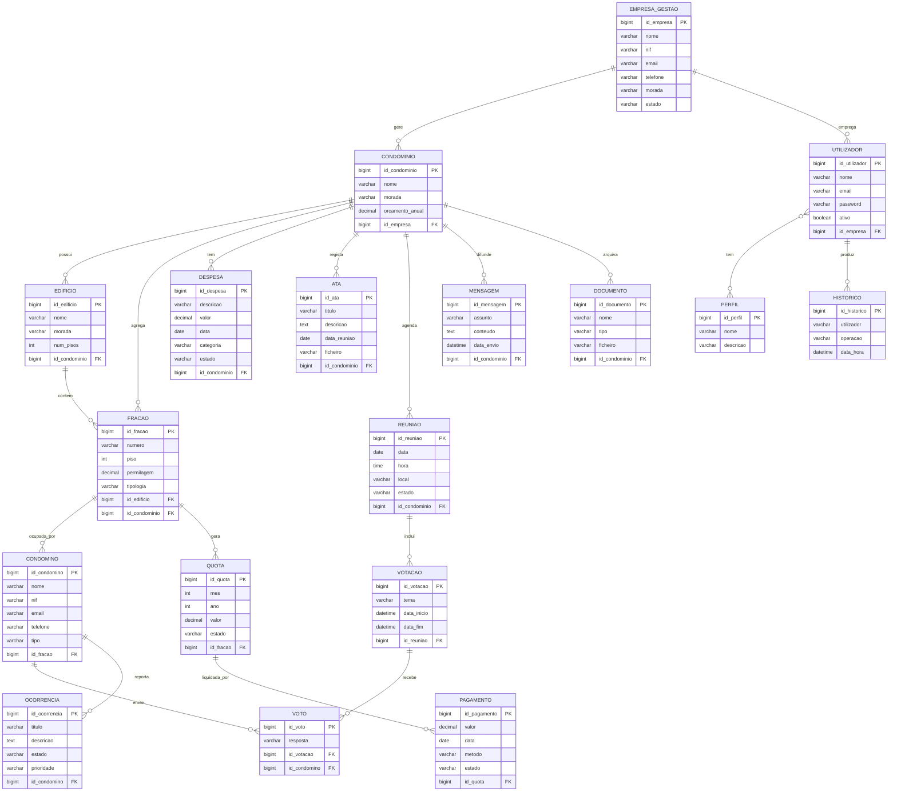
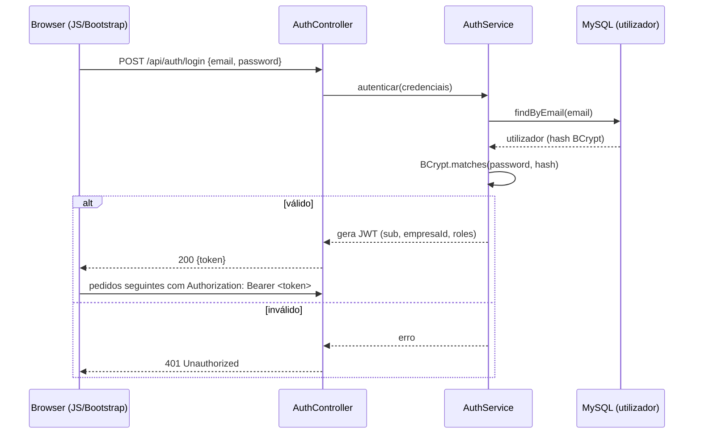
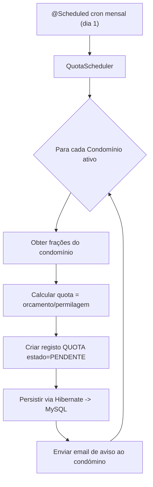
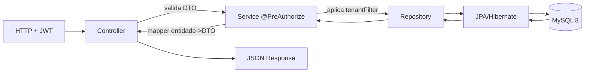
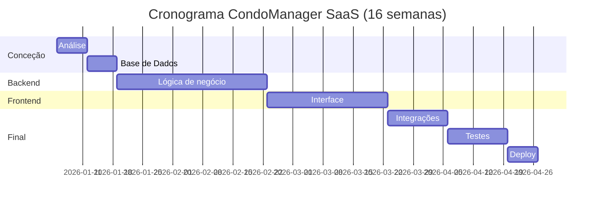

# Planeamento de Desenvolvimento — Sistema de Gestão de Condomínios (SGC)
### Produto: **CondoManager SaaS** · Projeto de Tecnologias e Programação de Sistemas de Informação

> Documento de planeamento técnico que **respeita e melhora** o plano original em PDF.
> Toda a arquitetura usa **exclusivamente** a stack definida no enunciado:
> HTML5 · CSS3 · JavaScript · Bootstrap · Java 21 · Spring Boot 3 · MySQL 8 · JPA/Hibernate · Spring Security · BCrypt · JWT · JasperReports.

---

## Índice

1. [Visão Geral do Produto](#1-visão-geral-do-produto)
2. [Stack Tecnológica (fixa)](#2-stack-tecnológica-fixa)
3. [Arquitetura SaaS Multi-Cliente](#3-arquitetura-saas-multi-cliente)
4. [Arquitetura em Camadas](#4-arquitetura-em-camadas)
5. [Perfis, Utilizadores e Permissões](#5-perfis-utilizadores-e-permissões)
6. [Requisitos Funcionais (RF01–RF20)](#6-requisitos-funcionais-rf01rf20)
7. [Requisitos Não Funcionais (RNF01–RNF10)](#7-requisitos-não-funcionais-rnf01rnf10)
8. [Modelo Relacional Completo](#8-modelo-relacional-completo) *(completa o "A FAZER")*
9. [Dicionário de Dados (DDL MySQL 8)](#9-dicionário-de-dados-ddl-mysql-8)
10. [Estrutura de Packages Java (corrigida)](#10-estrutura-de-packages-java-corrigida)
11. [Organigramas do Código (Mermaid)](#11-organigramas-do-código-mermaid) *(completa o "A FAZER")*
12. [Desenho da API REST](#12-desenho-da-api-rest)
13. [Planeamento Funcional por Módulos](#13-planeamento-funcional-por-módulos)
14. [Fases e Cronograma de Desenvolvimento](#14-fases-e-cronograma-de-desenvolvimento)
15. [Modelo de Negócio SaaS e Planos](#15-modelo-de-negócio-saas-e-planos)
16. [Estratégia de Testes e Qualidade](#16-estratégia-de-testes-e-qualidade)
17. [Deploy e Infraestrutura](#17-deploy-e-infraestrutura)
18. [Roadmap Comercial](#18-roadmap-comercial)
19. [Guião da Apresentação Comercial](#19-guião-da-apresentação-comercial)
20. [Melhorias face ao Plano Original](#20-melhorias-face-ao-plano-original)

---

## 1. Visão Geral do Produto

| Campo | Descrição |
|---|---|
| **Nome do Produto** | CondoManager SaaS |
| **Tipo** | Plataforma web — Software as a Service (SaaS) |
| **Objetivo** | Permitir que empresas de administração giram **múltiplos condomínios** (edifícios, frações, condóminos, pagamentos, atas, reuniões, votações, ocorrências, documentos e comunicação) numa única aplicação. |
| **Modelo de Negócio** | Subscrição mensal por plano (Starter / Business / Enterprise). |
| **Mercado-Alvo** | Empresas de Gestão de Condomínios · Administradores de Condomínio · Condomínios autogeridos · Condomínios residenciais e empresariais. |
| **Disponibilidade** | Acesso 24/7 via browser (desktop, tablet, smartphone). |

### Objetivos Específicos (do enunciado)
1. Centralizar a informação dos condomínios.
2. Melhorar a comunicação administração ↔ condóminos.
3. Automatizar a cobrança de quotas.
4. Reduzir o uso de papel.
5. Disponibilizar atas online.
6. Permitir votações digitais.
7. Agendar reuniões.
8. Controlar despesas.
9. Produzir relatórios de gestão.
10. Disponibilizar acesso 24 horas por dia.

---

## 2. Stack Tecnológica (fixa)

```
┌────────────────────────────────────────────────────────────────┐
│  FRONTEND   HTML5 · CSS3 · JavaScript ES6+ · Bootstrap 5         │
├────────────────────────────────────────────────────────────────┤
│  BACKEND    Java 21 · Spring Boot 3 (Web, Validation, Mail)      │
│  SEGURANÇA  Spring Security · BCrypt · JWT                       │
│  ORM        JPA (especificação)  →  Hibernate (implementação)    │
│  RELATÓRIOS JasperReports                                        │
├────────────────────────────────────────────────────────────────┤
│  DADOS      MySQL 8                                              │
├────────────────────────────────────────────────────────────────┤
│  INFRA      Ubuntu Linux · Nginx (proxy) · Let's Encrypt (SSL)   │
└────────────────────────────────────────────────────────────────┘
```

**Cadeia ORM (conforme PDF):** `JPA → Hibernate → MySQL`.
A JPA define as regras de acesso a dados; o Hibernate implementa-as; o MySQL persiste. Vantagens: menos SQL manual, desenvolvimento mais rápido, manutenção simples, integração nativa com Spring Boot, CRUD facilitado e relacionamentos complexos.

---

## 3. Arquitetura SaaS Multi-Cliente

O maior desafio do SaaS é o **isolamento de dados** entre clientes. Conforme o PDF, adota-se **Base de Dados Única / Esquema Único** (*Shared Database, Shared Schema*), o modelo mais simples e económico para arrancar.

```
Empresa A                         Empresa B
   ├─ Condomínio 1                    ├─ Condomínio 1
   └─ Condomínio 2                    └─ Condomínio 2
```

Cada empresa de gestão **só vê os seus próprios dados**.

### Como se garante o isolamento (melhoria concreta)
- Toda a entidade de negócio descende de `id_empresa` (raiz tenant).
- Filtro automático aplicado em **todas** as queries via **Hibernate Filter**:
  ```java
  @FilterDef(name = "tenantFilter", parameters = @ParamDef(name = "empresaId", type = Long.class))
  @Filter(name = "tenantFilter", condition = "id_empresa = :empresaId")
  ```
- O `empresaId` é extraído do **JWT** no `TenantInterceptor` e ativado por pedido — impede que um gestor da Empresa A leia dados da Empresa B mesmo que adultere um `id` no URL.
- `Administrador do Sistema` ignora o filtro (acesso global).

---

## 4. Arquitetura em Camadas

```
            ┌──────────────────────────┐
   Browser  │  HTML5 / CSS3 / JS / BS5  │  (Thymeleaf ou SPA fetch())
            └────────────┬─────────────┘
                         │  HTTP/JSON + JWT
            ┌────────────▼─────────────┐
            │   Controller Layer       │  @RestController / validação DTO
            ├──────────────────────────┤
            │   Service Layer          │  regras de negócio · @Transactional
            ├──────────────────────────┤
            │   Repository Layer       │  Spring Data JPA
            ├──────────────────────────┤
            │   JPA / Hibernate        │  mapeamento objeto-relacional
            ├──────────────────────────┤
            │   MySQL 8                │  persistência
            └──────────────────────────┘
```

Regra de dependência: cada camada só conhece a imediatamente inferior. Os DTOs cruzam a fronteira Controller↔Service; as entidades JPA **nunca** são expostas diretamente na API (uso de `mapper`).

---

## 5. Perfis, Utilizadores e Permissões

### 5.1 Tipos de Utilizador
1. **Administrador do Sistema** — acesso total.
2. **Gestor da Empresa** — administra todos os condomínios da sua empresa.
3. **Funcionário** — tarefas operacionais.
4. **Administrador de Condomínio** — administra um condomínio específico.
5. **Condómino** — consulta informação e participa em votações.

### 5.2 Matriz de Permissões (do PDF)

| Funcionalidade | Admin Sistema | Gestor | Funcionário | Admin Condomínio | Condómino |
|---|:---:|:---:|:---:|:---:|:---:|
| Empresas | ✅ | ✅ | ❌ | ❌ | ❌ |
| Condomínios | ✅ | ✅ | ✅ | ❌ | ❌ |
| Condóminos | ✅ | ✅ | ✅ | ✅ | ❌ |
| Utilizadores | ✅ | ✅ | ❌ | ❌ | ❌ |
| Atas | ✅ | ✅ | ✅ | ✅ | Consulta |
| Pagamentos | ✅ | ✅ | Consulta | Consulta | Consulta |
| Reuniões | ✅ | ✅ | ✅ | ✅ | Consulta |
| Votações | ✅ | ✅ | ✅ | ✅ | Participa |
| Documentos | ✅ | ✅ | ✅ | ✅ | Consulta |
| Mensagens | ✅ | ✅ | ✅ | ✅ | Recebe |

> O Gestor pode gerir utilizadores **exceto** o Administrador do Sistema.

### 5.3 Implementação (Spring Security)
- Roles: `ROLE_ADMIN_SISTEMA`, `ROLE_GESTOR`, `ROLE_FUNCIONARIO`, `ROLE_ADMIN_CONDOMINIO`, `ROLE_CONDOMINO`.
- Mapeamento `utilizador` ↔ `perfil` **Many-to-Many**.
- Proteção por método com `@PreAuthorize`:
  ```java
  @PreAuthorize("hasAnyRole('ADMIN_SISTEMA','GESTOR')")
  public EmpresaDTO criarEmpresa(EmpresaDTO dto) { ... }
  ```

---

## 6. Requisitos Funcionais (RF01–RF20)

| # | Requisito | Descrição |
|---|---|---|
| RF01 | Autenticação | Login por email + password. |
| RF02 | Gestão de Empresas | CRUD de empresas de gestão. |
| RF03 | Gestão de Condomínios | CRUD de condomínios. |
| RF04 | Gestão de Edifícios | CRUD de edifícios associados a um condomínio. |
| RF05 | Gestão de Frações | CRUD de frações (Apto A/B, Loja 1/2). |
| RF06 | Gestão de Condóminos | CRUD de condóminos. |
| RF07 | Gestão de Utilizadores | Criação de contas de acesso. |
| RF08 | Gestão de Atas | Criar, consultar e arquivar atas. |
| RF09 | Gestão Documental | Armazenar regulamentos, contratos, orçamentos, atas, faturas, apólices. |
| RF10 | Gestão de Pagamentos | Registo de quotas, pagamentos e dívidas. |
| RF11 | Gestão de Reuniões | Agendamento de reuniões. |
| RF12 | Gestão de Votações | Votações online. |
| RF13 | Gestão de Mensagens | Envio a um condómino, grupo ou todos. |
| RF14 | Gestão de Ocorrências | Avarias, reclamações, sugestões. |
| RF15 | Gestão de Despesas | Registo de despesas comuns. |
| RF16 | Relatórios | Geração de relatórios (JasperReports). |
| RF17 | Histórico de Atividades | Logs de auditoria. |
| RF18 | Dashboard | Indicadores em tempo real. |
| RF19 | Recuperação de Password | Reposição de credenciais por email. |
| RF20 | Perfil de Utilizador | Atualização dos dados pessoais. |

---

## 7. Requisitos Não Funcionais (RNF01–RNF10)

| # | Requisito | Critério |
|---|---|---|
| RNF01 | Segurança | Passwords com **BCrypt**; transporte HTTPS; JWT assinado. |
| RNF02 | Disponibilidade | ≥ 99%. |
| RNF03 | Performance | Tempo médio de resposta < 3 s. |
| RNF04 | Escalabilidade | Suporte a múltiplos condomínios/empresas. |
| RNF05 | Responsividade | Desktop, tablet e smartphone (Bootstrap 5). |
| RNF06 | Base de Dados SQL | **MySQL 8** obrigatório. |
| RNF07 | Multi-idioma | Português e Inglês (i18n). |
| RNF08 | Dark Mode | Tema escuro comutável. |
| RNF09 | Auditoria | Registo de operações. |
| RNF10 | Backup | Backup automático diário. |

---

## 8. Modelo Relacional Completo

> Completa os pontos **"A FAZER"** do PDF: tabelas `edificio`, `perfil`, `despesa` e a relação `utilizador`↔`perfil`, mantendo as entidades já definidas. Estimativa: **18–25 tabelas**.

### 8.1 Diagrama Entidade-Relação (Mermaid)



### 8.2 Cadeia raiz (do PDF)
```
[empresa_gestao] ──(1:N)── [condominio] ──(1:N)── [fracao] ──(1:N)── [quota/fatura]
```

---

## 9. Dicionário de Dados (DDL MySQL 8)

> Excerto representativo das tabelas-chave e das que estavam **"A FAZER"** no PDF (`edificio`, `perfil`, `despesa` + tabela de junção `utilizador_perfil`).

```sql
CREATE TABLE empresa_gestao (
  id_empresa   BIGINT AUTO_INCREMENT PRIMARY KEY,
  nome         VARCHAR(150) NOT NULL,
  nif          VARCHAR(20)  NOT NULL UNIQUE,
  email        VARCHAR(150) NOT NULL,
  telefone     VARCHAR(20),
  morada       VARCHAR(255),
  estado       VARCHAR(20)  DEFAULT 'ATIVA',
  plano        VARCHAR(20)  DEFAULT 'STARTER'  -- Starter/Business/Enterprise
) ENGINE=InnoDB;

CREATE TABLE condominio (
  id_condominio   BIGINT AUTO_INCREMENT PRIMARY KEY,
  nome            VARCHAR(150) NOT NULL,
  morada          VARCHAR(255),
  orcamento_anual DECIMAL(12,2) DEFAULT 0,
  id_empresa      BIGINT NOT NULL,
  CONSTRAINT fk_cond_empresa FOREIGN KEY (id_empresa) REFERENCES empresa_gestao(id_empresa)
) ENGINE=InnoDB;

-- A FAZER do PDF: tabela edificio
CREATE TABLE edificio (
  id_edificio   BIGINT AUTO_INCREMENT PRIMARY KEY,
  nome          VARCHAR(150) NOT NULL,
  morada        VARCHAR(255),
  num_pisos     INT,
  id_condominio BIGINT NOT NULL,
  CONSTRAINT fk_edif_cond FOREIGN KEY (id_condominio) REFERENCES condominio(id_condominio)
) ENGINE=InnoDB;

CREATE TABLE fracao (
  id_fracao     BIGINT AUTO_INCREMENT PRIMARY KEY,
  numero        VARCHAR(20) NOT NULL,
  piso          INT,
  permilagem    DECIMAL(7,3),     -- soma das frações deve dar 1000
  tipologia     VARCHAR(30),      -- T0,T1,T2,Loja...
  id_edificio   BIGINT,
  id_condominio BIGINT NOT NULL,
  CONSTRAINT fk_frac_edif FOREIGN KEY (id_edificio) REFERENCES edificio(id_edificio),
  CONSTRAINT fk_frac_cond FOREIGN KEY (id_condominio) REFERENCES condominio(id_condominio)
) ENGINE=InnoDB;

CREATE TABLE condomino (
  id_condomino BIGINT AUTO_INCREMENT PRIMARY KEY,
  nome         VARCHAR(150) NOT NULL,
  nif          VARCHAR(20),
  email        VARCHAR(150),
  telefone     VARCHAR(20),
  tipo         VARCHAR(20) DEFAULT 'PROPRIETARIO', -- PROPRIETARIO/INQUILINO
  id_fracao    BIGINT,
  CONSTRAINT fk_condo_frac FOREIGN KEY (id_fracao) REFERENCES fracao(id_fracao)
) ENGINE=InnoDB;

CREATE TABLE utilizador (
  id_utilizador BIGINT AUTO_INCREMENT PRIMARY KEY,
  nome          VARCHAR(150) NOT NULL,
  email         VARCHAR(150) NOT NULL UNIQUE,
  password      VARCHAR(60)  NOT NULL,   -- hash BCrypt
  ativo         BOOLEAN      DEFAULT TRUE,
  id_empresa    BIGINT,
  CONSTRAINT fk_util_empresa FOREIGN KEY (id_empresa) REFERENCES empresa_gestao(id_empresa)
) ENGINE=InnoDB;

-- A FAZER do PDF: tabela perfil + junção Many-to-Many
CREATE TABLE perfil (
  id_perfil BIGINT AUTO_INCREMENT PRIMARY KEY,
  nome      VARCHAR(40) NOT NULL UNIQUE,  -- ROLE_GESTOR, ...
  descricao VARCHAR(150)
) ENGINE=InnoDB;

CREATE TABLE utilizador_perfil (
  id_utilizador BIGINT NOT NULL,
  id_perfil     BIGINT NOT NULL,
  PRIMARY KEY (id_utilizador, id_perfil),
  FOREIGN KEY (id_utilizador) REFERENCES utilizador(id_utilizador),
  FOREIGN KEY (id_perfil)     REFERENCES perfil(id_perfil)
) ENGINE=InnoDB;

CREATE TABLE quota (
  id_quota  BIGINT AUTO_INCREMENT PRIMARY KEY,
  mes       INT NOT NULL,
  ano       INT NOT NULL,
  valor     DECIMAL(10,2) NOT NULL,
  estado    VARCHAR(20) DEFAULT 'PENDENTE', -- PENDENTE/PAGA/ATRASO
  id_fracao BIGINT NOT NULL,
  CONSTRAINT fk_quota_frac FOREIGN KEY (id_fracao) REFERENCES fracao(id_fracao)
) ENGINE=InnoDB;

CREATE TABLE pagamento (
  id_pagamento BIGINT AUTO_INCREMENT PRIMARY KEY,
  valor        DECIMAL(10,2) NOT NULL,
  data         DATE NOT NULL,
  metodo       VARCHAR(20),  -- MBWAY/TRANSFERENCIA/PAYPAL
  estado       VARCHAR(20) DEFAULT 'CONFIRMADO',
  id_quota     BIGINT NOT NULL,
  CONSTRAINT fk_pag_quota FOREIGN KEY (id_quota) REFERENCES quota(id_quota)
) ENGINE=InnoDB;

-- A FAZER do PDF: tabela despesa
CREATE TABLE despesa (
  id_despesa    BIGINT AUTO_INCREMENT PRIMARY KEY,
  descricao     VARCHAR(255) NOT NULL,
  valor         DECIMAL(10,2) NOT NULL,
  data          DATE NOT NULL,
  categoria     VARCHAR(50),  -- LIMPEZA/MANUTENCAO/SEGUROS...
  estado        VARCHAR(20) DEFAULT 'PENDENTE', -- PENDENTE/APROVADA/PAGA
  id_condominio BIGINT NOT NULL,
  CONSTRAINT fk_desp_cond FOREIGN KEY (id_condominio) REFERENCES condominio(id_condominio)
) ENGINE=InnoDB;

CREATE TABLE historico (
  id_historico BIGINT AUTO_INCREMENT PRIMARY KEY,
  utilizador   VARCHAR(150),
  operacao     VARCHAR(255),
  data_hora    DATETIME DEFAULT CURRENT_TIMESTAMP
) ENGINE=InnoDB;
```
*(As restantes — `ata`, `reuniao`, `votacao`, `voto`, `mensagem`, `documento`, `ocorrencia` — seguem os campos listados no PDF, com FK para o respetivo condomínio/votação.)*

---

## 10. Estrutura de Packages Java (corrigida)

> O PDF apresentava erros tipográficos (`servisse`, `repositor`, `útil`). Versão corrigida e profissional:

```
com.condomanager
├── controller        # @RestController — endpoints REST
├── service           # regras de negócio · @Transactional
│   └── impl
├── repository        # interfaces Spring Data JPA
├── model             # entidades JPA (@Entity)
│   └── enums
├── dto               # objetos de transferência (request/response)
├── mapper            # entidade ↔ DTO (MapStruct opcional)
├── security          # SecurityConfig, JwtFilter, TenantInterceptor
├── configuration     # beans, i18n, CORS, OpenAPI
├── exception         # @ControllerAdvice, exceções de domínio
├── util              # helpers genéricos
├── report            # integração JasperReports
└── validation        # validadores personalizados (@Valid)
```

---

## 11. Organigramas do Código (Mermaid)

> Completa o **"A FAZER — Organigramas do Código"** do PDF (que apenas referenciava um link externo do Mermaid).

### 11.1 Fluxo de Autenticação (JWT + BCrypt)



### 11.2 Faturação Automática de Quotas (`@Scheduled`)



### 11.3 Fluxo Genérico de um Pedido CRUD (camadas)



---

## 12. Desenho da API REST

| Recurso | Método | Endpoint | Perfis |
|---|---|---|---|
| Autenticação | POST | `/api/auth/login` | público |
| Recuperar password | POST | `/api/auth/recuperar` | público |
| Empresas | GET/POST/PUT/DELETE | `/api/empresas` | Admin Sistema, Gestor |
| Condomínios | GET/POST/PUT/DELETE | `/api/condominios` | Gestor, Funcionário |
| Edifícios | GET/POST/PUT/DELETE | `/api/edificios` | Gestor, Funcionário |
| Frações | GET/POST/PUT/DELETE | `/api/fracoes` | Gestor, Funcionário |
| Condóminos | GET/POST/PUT/DELETE | `/api/condominos` | Gestor, Func., Admin Cond. |
| Quotas | GET/POST | `/api/quotas` | Gestor |
| Pagamentos | GET/POST | `/api/pagamentos` | Gestor / Condómino (próprio) |
| Despesas | GET/POST/PUT | `/api/despesas` | Gestor |
| Atas | GET/POST/PUT | `/api/atas` | Gestor, Func., Admin Cond. |
| Reuniões | GET/POST | `/api/reunioes` | Gestor, Admin Cond. |
| Votações / Votos | GET/POST | `/api/votacoes`, `/api/votos` | todos (consoante perfil) |
| Mensagens | POST | `/api/mensagens` | Gestor, Func., Admin Cond. |
| Documentos | GET/POST | `/api/documentos` | conforme matriz |
| Ocorrências | GET/POST/PUT | `/api/ocorrencias` | Condómino (criar), Gestor |
| Dashboard | GET | `/api/dashboard` | Gestor |
| Relatórios | GET | `/api/relatorios/{tipo}` | Gestor |

Convenções: respostas JSON, paginação (`?page=&size=`), códigos HTTP padrão (200/201/204/400/401/403/404), erros uniformes via `@ControllerAdvice`.

---

## 13. Planeamento Funcional por Módulos

| Mód. | Nome | Entidade(s) | Tecnologias | Tempo |
|---|---|---|---|---|
| 1 | Autenticação e Segurança | utilizador, perfil | Spring Security, BCrypt, JWT | 1 sem |
| 2 | Gestão de Empresas | EmpresaGestao | Spring Boot, JPA | 3 dias |
| 3 | Gestão de Condomínios | Condominio | JPA | 4 dias |
| 4 | Gestão de Edifícios | Edificio | JPA | 3 dias |
| 5 | Gestão de Frações | Fracao | JPA | 4 dias |
| 6 | Gestão de Condóminos | Condomino | JPA | 5 dias |
| 7 | Gestão de Utilizadores | Utilizador | Spring Security | 4 dias |
| 8 | Gestão de Pagamentos | Quota, Pagamento | @Scheduled, JPA | 2 sem |
| 9 | Gestão de Despesas | Despesa | JPA | 1 sem |
| 10 | Gestão Documental | Documento | upload/download | 1 sem |
| 11 | Gestão de Atas | Ata | JPA | 4 dias |
| 12 | Gestão de Reuniões | Reuniao | JPA | 4 dias |
| 13 | Votação Digital | Votacao, Voto | JPA | 1 sem |
| 14 | Comunicação | Mensagem | Spring Mail | 1 sem |
| 15 | Gestão de Ocorrências | Ocorrencia | JPA | 1 sem |
| 16 | Dashboard | (agregações) | JS + REST | 1 sem |
| 17 | Relatórios | (views) | JasperReports (PDF/Excel) | 1 sem |
| 18 | Auditoria | Historico | AOP / listeners | 4 dias |

**Indicadores do Dashboard:** condomínios ativos, condóminos ativos, dívidas pendentes, receita mensal, reuniões agendadas.
**Relatórios:** pagamentos em atraso, faturação, despesas, condóminos, atas, votações — exportáveis em PDF e Excel.

---

## 14. Fases e Cronograma de Desenvolvimento

| Fase | Descrição | Duração |
|---|---|---|
| 1 | Análise e desenho funcional | 1 semana |
| 2 | Modelação da BD e Segurança | 1 semana |
| 3 | Lógica de negócio central (CRUDs, motor de faturação `@Scheduled`, rotas REST com `@PreAuthorize`) | 5 semanas |
| 4 | Interface (HTML5 semântico, CSS3, JS, Bootstrap 5) | 4 semanas |
| 5 | Relatórios e Alertas (JasperReports + emails de cobrança) | *(incl. na est. global)* |
| 6 | Integrações (MBWay, Transferência, PayPal) | 2 semanas |
| 7 | Testes | 2 semanas |
| 8 | Deploy | 1 semana |



**Tempo total estimado: 16 semanas (≈ 4 meses)** para a 1.ª versão SaaS profissional.

---

## 15. Modelo de Negócio SaaS e Planos

| Plano | Limite | Público | Funcionalidades |
|---|---|---|---|
| **Starter** | até 50 frações | condomínios pequenos / autogeridos | CRUD base, pagamentos, atas |
| **Business** | até 300 frações | empresas de gestão | + votações, reuniões, dashboard, relatórios |
| **Enterprise** | frações ilimitadas | grandes empresas | + multi-empresa, auditoria avançada, prioridade de suporte |

Faturação por **subscrição mensal**. O campo `empresa_gestao.plano` controla os limites (validação no Service ao criar frações).

---

## 16. Estratégia de Testes e Qualidade

- **Unitários** — JUnit 5 + Mockito na camada Service (regras de faturação, permilagem, estados de quota).
- **Integração** — Spring Boot Test + MySQL de teste (Testcontainers/H2) para repositórios e fluxo REST.
- **Segurança** — testes de autorização por perfil (`@WithMockUser`), isolamento multi-tenant (Empresa A não acede a dados da Empresa B).
- **Validação** — DTOs com Bean Validation (`@NotNull`, `@Email`, `@Positive`).
- **Cobertura-alvo** — ≥ 70% na camada de negócio.
- **Aceitação** — checklist sobre os 20 RF e 10 RNF.

---

## 17. Deploy e Infraestrutura

```
Internet ──HTTPS──▶ Nginx (proxy + SSL Let's Encrypt)
                        │
                        ▼
              Spring Boot (serviço systemd, JAR)
                        │  JDBC
                        ▼
                    MySQL 8
```

- **SO:** Ubuntu Linux Server.
- **Backend:** Spring Boot empacotado como JAR, executado como serviço `systemd`.
- **Proxy:** Nginx (reverse proxy, gzip, cache de estáticos).
- **SSL:** Let's Encrypt (renovação automática).
- **Backup:** `mysqldump` diário agendado (RNF10).
- **Perfis Spring:** `application-dev.properties` / `application-prod.properties`.

---

## 18. Roadmap Comercial

| Versão | Conteúdo |
|---|---|
| **1.0** | Gestão de Condomínios · Condóminos · Pagamentos · Atas |
| **2.0** | Votação Digital · Reuniões Online · Dashboard Avançado |
| **3.0** | Aplicação Mobile · Notificações Push · Inteligência Artificial |

---

## 19. Guião da Apresentação Comercial (25–30 min)

| Secção | Tempo | Conteúdo |
|---|---|---|
| Introdução | 3 min | Problema do mercado |
| Solução | 5 min | Apresentação do sistema |
| Arquitetura | 5 min | Tecnologias utilizadas |
| Demonstração | 10 min | Login · Condomínios · Condóminos · Pagamentos · Atas · Reuniões · Votações |
| Modelo SaaS | 3 min | Subscrições e escalabilidade |
| Conclusão | 2 min | Benefícios para administradores e condóminos |

---

## 20. Melhorias face ao Plano Original

Este documento **respeita integralmente** o PDF e **acrescenta**, completando os pontos marcados como *"A FAZER"*:

1. ✅ **Modelo relacional completo** com diagrama ER (Mermaid) e cardinalidades — antes parcial.
2. ✅ **Tabelas em falta** (`edificio`, `perfil`, `despesa`, junção `utilizador_perfil`) com DDL MySQL 8.
3. ✅ **Estrutura de packages corrigida** (`service`, `repository`, `util` — antes com erros).
4. ✅ **Organigramas do código** desenhados (autenticação JWT, faturação `@Scheduled`, fluxo CRUD) — antes só um link externo.
5. ✅ **Estratégia de isolamento multi-tenant** explícita (Hibernate Filter + JWT).
6. ✅ **Desenho da API REST** com endpoints e perfis.
7. ✅ **Estratégia de testes** detalhada — ausente no original.
8. ✅ **Planos SaaS** ligados ao modelo de dados (`empresa_gestao.plano`).
9. ✅ Cronograma com **diagrama de Gantt**.
10. ✅ Mantém-se **100% dentro da stack** exigida (sem tecnologias externas ao enunciado).
```
