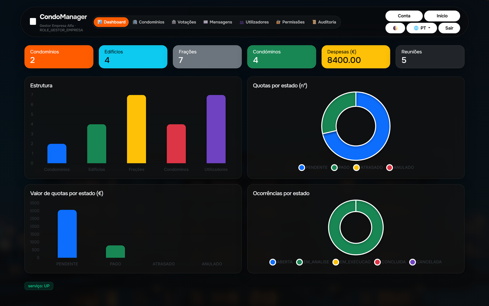
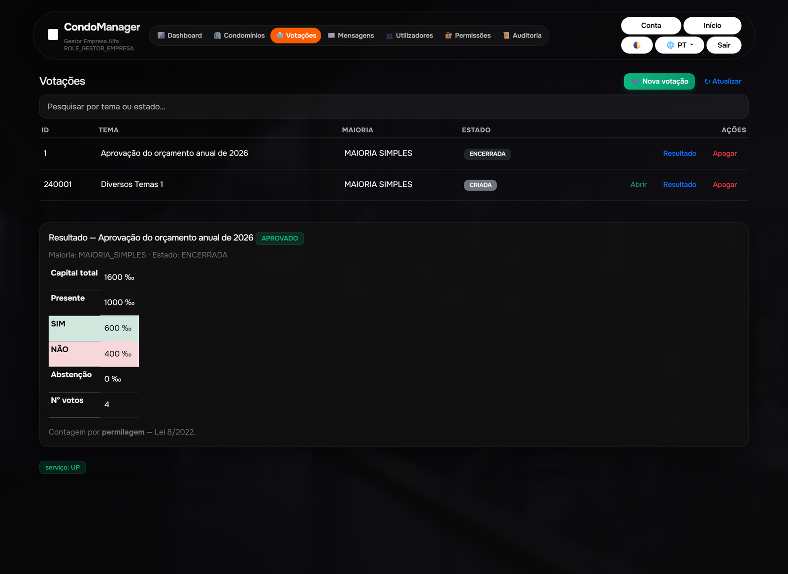
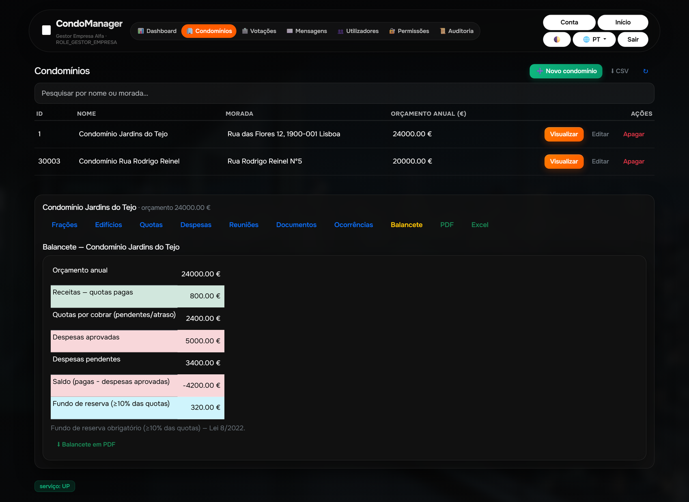
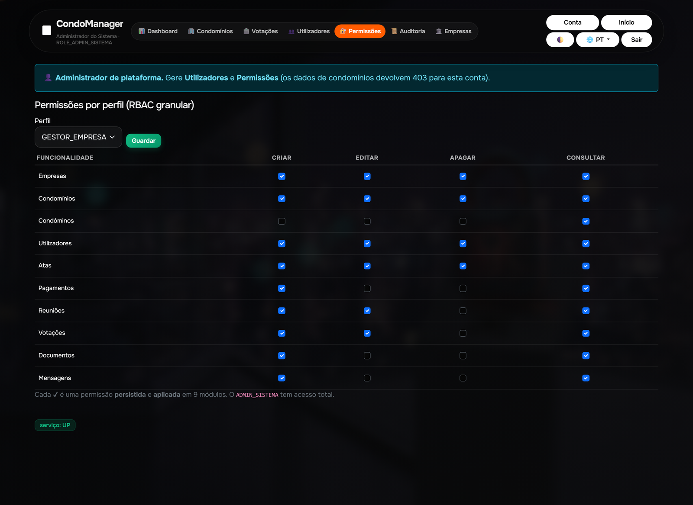
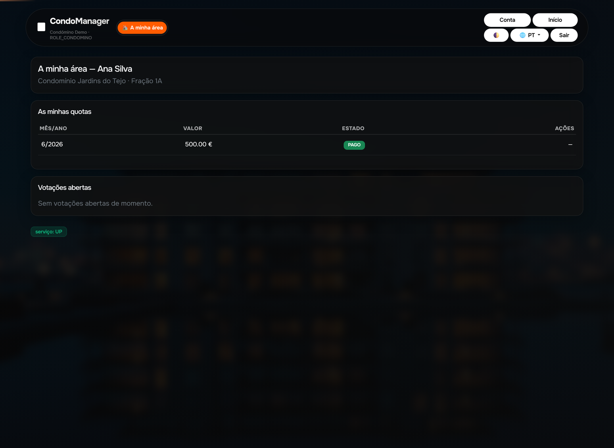

# 🏢 CondoManager — Sistema de Gestão de Condomínios (SaaS)

📖 **Idiomas:** Português · [English](README.en.md)

Plataforma **SaaS multi-tenant** para a gestão de condomínios, alinhada com a
**Lei 8/2022** (quotas por permilagem, quórum/maiorias, fundo de reserva).
Java 21 · Spring Boot 3 · MySQL/TiDB · Frontend SPA (Bootstrap 5 + Chart.js).

## 🌐 Demonstração ao vivo

- **App:** <https://condomanager.onrender.com>
- **Página comercial:** <https://condomanager.onrender.com/landing.html>
- **API (Swagger):** <https://condomanager.onrender.com/swagger-ui.html>
- **Health:** <https://condomanager.onrender.com/api/v1/health>

> A instância gratuita do Render adormece após ~15 min — o 1.º acesso pode demorar
> ~30-60 s (cold start). Ver [`docs/HOSTING.md`](docs/HOSTING.md).

### Contas de demonstração

| Perfil | Email | Password | O que vê |
|--------|-------|----------|----------|
| **Gestor** | `gestor.alfa@demo.local` | `gestor123` | Gestão completa do(s) condomínio(s) |
| **Administrador** | `admin@condomanager.local` | `admin123` | Utilizadores, Permissões, Auditoria, Empresas |
| **Condómino** | `portal.demo@demo.local` | `portal123` | Portal self-service (as minhas quotas, votar) |

## 📸 Vista geral



> Dashboard do gestor (tema escuro): KPIs do condomínio e gráficos interativos
> (estrutura, quotas por estado e por valor, ocorrências por estado).

| Votações (contagem por permilagem) | Balancete / Tesouraria |
|---|---|
| [](docs/img/votacoes.png) | [](docs/img/balancete.png) |
| **Permissões — RBAC granular** | **Portal do Condómino** |
| [](docs/img/permissoes.png) | [](docs/img/portal.png) |

## ✨ Funcionalidades

**Gestão do condomínio**
- Condomínios, edifícios, **frações** (permilagem, base 1000) e **condóminos**.
- **Quotas** por permilagem (`quota = orçamento × permilagem ÷ 1000`) e **pagamentos**
  (manuais + **pagamento online** com referência Multibanco — *scaffolding* pronto para Stripe/SIBS).
- **Despesas** (aprovação/rejeição) e **Balancete/Tesouraria** (receitas, despesas, saldo e
  **fundo de reserva ≥10%**).
- **Reuniões** (agendar, convocar por email, realizar/cancelar), **Atas** (com anexos) e **Documentos**.
- **Votações** com contagem por **permilagem** e maiorias da Lei 8/2022; **Ocorrências**.
- **Mensagens** internas (individual / difusão), **Notificações** (lembretes de quotas em atraso).

**Plataforma**
- **Multi-tenant** (isolamento por `id_empresa`), **Empresas** (gestão de tenants).
- **RBAC granular** persistente (matriz perfil × funcionalidade × ação) aplicado em 10 módulos.
- **Portal do Condómino** (self-service): contexto, as minhas quotas, pagar e **votar**.
- **Auditoria** imutável (pesquisa, filtros, paginação), **Relatórios PDF/Excel**
  (quotas, despesas, ocorrências, balancete).
- **i18n** (PT; EN/FR em construção), tema claro/escuro, fundos temáticos por menu.

## 🧰 Stack

| Camada | Tecnologias |
|--------|-------------|
| Backend | Java 21, Spring Boot 3.3 (Web, Security, Data JPA, Validation, Actuator) |
| Persistência | MySQL 8 / TiDB Cloud, **Flyway** (migrações V1–V22) |
| Segurança | JWT, BCrypt, RBAC granular, rate-limiting no login, RGPD |
| Relatórios | JasperReports (PDF/Excel) |
| Frontend | SPA `static/` — Bootstrap 5.3, Chart.js, vanilla JS (`js/app.js`, `css/app.css`) |
| API docs | springdoc-openapi (Swagger UI) |
| Observabilidade | Spring Actuator + Micrometer/Prometheus |
| Deploy | Docker + Render (free) + TiDB Cloud Serverless; email via Resend (HTTP) |
| Testes | JUnit 5 + Mockito (unitários/integração) + Playwright (smoke E2E em `e2e/`) |

Detalhe em [`docs/TECH_STACK.md`](docs/TECH_STACK.md) e [`docs/ARCHITECTURE.md`](docs/ARCHITECTURE.md).

## 🏗️ Arquitetura (resumo)

- **Multi-tenant** por discriminador `id_empresa` + filtro Hibernate; tenant resolvido do *claim* do JWT.
- Camadas `controller → service → repository`, DTOs/records, mappers.
- **Segurança**: JWT (1 h) + filtro de autenticação; `@PreAuthorize` com RBAC granular
  (`@permissaoService.pode('MODULO','ACAO')`); o `ADMIN_SISTEMA` tem acesso total.
- **Endpoints `/me`** (Portal do Condómino) — tudo *scoped* à própria fração.

## ▶️ Como executar localmente

Pré-requisitos: **JDK 21**, **Maven**, **Docker** (para o MySQL).

```bash
docker compose up -d          # MySQL 8 (mapeia 3307->3306)
mvn clean verify              # compila + testes
mvn spring-boot:run           # arranca em http://localhost:8080
```

- Frontend: <http://localhost:8080/> · Swagger: `/swagger-ui.html` · Health: `/api/v1/health`
- Perfil `dev` semeia as contas de demonstração.
- Portas ocupadas? `set DB_PORT=3307` e `set SERVER_PORT=8081` (ver notas em `docs/`).

### Testes E2E (Playwright)

```bash
cd e2e && npm install && npx playwright install chromium && npm test
```

## 🚀 Deploy

Render (Docker, free) + TiDB Cloud Serverless. `git push` para `master` → autoDeploy.
Um workflow do GitHub Actions faz *keep-alive* a cada ~12 min.
Detalhes e escalabilidade em [`docs/HOSTING.md`](docs/HOSTING.md) e [`docs/DEPLOY-RENDER.md`](docs/DEPLOY-RENDER.md).

## ⚖️ Conformidade legal (Lei 8/2022)

Quotas e votos por **permilagem** (base 1000), **quórum/maiorias** por tipo de deliberação,
**fundo comum de reserva ≥10%**, convocatórias com antecedência. Ver [`docs/LEGAL_RULES.md`](docs/LEGAL_RULES.md).

## 📚 Documentação

Especificação, regras de negócio/legais, arquitetura, base de dados e roadmap em [`docs/`](docs/) —
em especial [`docs/SPEC.md`](docs/SPEC.md), [`docs/LEGAL_RULES.md`](docs/LEGAL_RULES.md) e
[`docs/GUIAO_APRESENTACAO.md`](docs/GUIAO_APRESENTACAO.md) (guião de apresentação).
