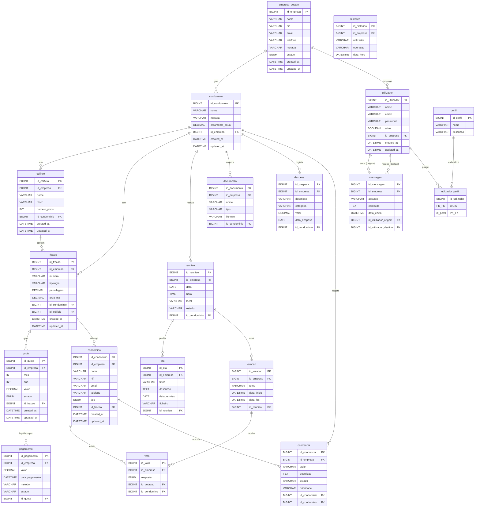

# Diagrama Relacional — Sistema de Gestão de Condomínios

Modelo Entidade-Relação (ERD) de todas as tabelas da base de dados.
A entidade `empresa_gestao` é o **tenant** (multi-empresa): quase todas as tabelas
têm `id_empresa` para isolamento de dados por empresa.

## Diagrama completo

## Vista de isolamento multi-empresa (tenant)

`empresa_gestao` é referenciada por `id_empresa` em **todas** as tabelas operacionais.
Para não poluir o diagrama principal, essas ligações estão resumidas aqui:

```mermaid
erDiagram
    empresa_gestao ||--o{ condominio  : id_empresa
    empresa_gestao ||--o{ edificio    : id_empresa
    empresa_gestao ||--o{ fracao      : id_empresa
    empresa_gestao ||--o{ condomino   : id_empresa
    empresa_gestao ||--o{ utilizador  : id_empresa
    empresa_gestao ||--o{ quota       : id_empresa
    empresa_gestao ||--o{ pagamento   : id_empresa
    empresa_gestao ||--o{ despesa     : id_empresa
    empresa_gestao ||--o{ reuniao     : id_empresa
    empresa_gestao ||--o{ ata         : id_empresa
    empresa_gestao ||--o{ votacao     : id_empresa
    empresa_gestao ||--o{ voto        : id_empresa
    empresa_gestao ||--o{ mensagem    : id_empresa
    empresa_gestao ||--o{ documento   : id_empresa
    empresa_gestao ||--o{ ocorrencia  : id_empresa
    empresa_gestao ||--o{ historico   : id_empresa
```

## Resumo das cardinalidades

| Lado "um" (1) | Lado "muitos" (N) | Chave estrangeira | Notas |
|---|---|---|---|
| empresa_gestao | condominio | id_empresa | Tenant |
| empresa_gestao | utilizador | id_empresa | |
| condominio | edificio | id_condominio | |
| condominio | fracao | id_condominio | |
| condominio | reuniao | id_condominio | |
| condominio | documento | id_condominio | |
| condominio | despesa | id_condominio | |
| condominio | ocorrencia | id_condominio | |
| edificio | fracao | id_edificio | |
| fracao | quota | id_fracao | |
| fracao | condomino | id_fracao | |
| quota | pagamento | id_quota | |
| reuniao | ata | id_reuniao | |
| reuniao | votacao | id_reuniao | |
| votacao | voto | id_votacao | |
| condomino | voto | id_condomino | |
| condomino | ocorrencia | id_condomino | |
| utilizador | mensagem | id_utilizador_origem | Remetente |
| utilizador | mensagem | id_utilizador_destino | Destinatário |
| utilizador ↔ perfil | utilizador_perfil | (id_utilizador, id_perfil) | M:N, PK composta |

### Notação (Crow's Foot / Mermaid)
- `||--o{` → **um-para-muitos** (1:N): o "1" é obrigatório, o "muitos" é opcional (0..N).
- `utilizador_perfil` é a **tabela de junção** que resolve o M:N entre `utilizador` e `perfil`, com chave primária composta `(id_utilizador, id_perfil)`.
- `mensagem` tem **duas** FKs para `utilizador` (origem e destino) — auto-relação dupla.
- `voto` e `ocorrencia` ligam-se a **dois pais** (votacao+condomino / condominio+condomino).
